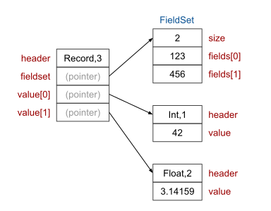
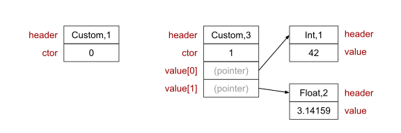

In my [last post][first-class-functions], I proposed some ideas for how Elm's first-class functions could work in WebAssembly.

This time, let's look at some of the other value types in Elm. What do the most fundamental value types look like? Can integers and floating-point numbers just be raw machine numbers, or do they need to have some kind of wrapper? How about collections like Lists, Tuples and Union types? And what about the big one - extensible records, how would they work?

We'll cover all of that in this post. Then in future posts we'll look at some more related topics like string encoding and effect types.

By the way, WebAssembly is still an MVP and won’t really be ready for Elm until it has garbage collection (GC), and probably also direct access to Web APIs (which depends on GC). The [GC extension][gc-ext] is still in ["feature proposal"][gc-proposal] stage (as of August 2018) so it could be a while before it's available. Also, I'm not part of the Elm core team.

[first-class-functions]: https://dev.to/briancarroll/elm-functions-in-webassembly-50ak
[gc-ext]: https://github.com/WebAssembly/design/issues/1079
[gc-proposal]: https://github.com/WebAssembly/gc/blob/master/proposals/gc/Overview.md


## Comparables, Appendables and Numbers

Let's start with the fundamentals: `Int`, `Float`, `Char`, `String`, `List` and `Tuple`. You probably learned these during your first day or two of Elm, and each of them has fairly straightforward byte level implementations. But there are also some subtleties that we need to tackle.

The trickiest aspect of these types in Elm is that they are all members of [constrained type variables][guide-type-vars]. This is the mechanism that allows some functions like `++`, `+` and `>`, to work on *more than one, but not all* value types.

[guide-type-vars]: https://guide.elm-lang.org/types/reading_types.html#constrained-type-variables

The table below lists the four constrained type variables, and which functions from the core libraries use them.

| **Type variable** | **Core library functions**                                   |
| ----------------- | ------------------------------------------------------------ |
| `appendable`      | `++`                                                         |
| `number`          | `+`, `-`, `*`, `/`, `^`, `negate`, `abs`, `clamp`            |
| `comparable`      | `compare`, `<`, `>`, `<=`, `>=`, `max`, `min`, `Dict.*`, `Set.*` |
| `compappend`      | (Not used)                                                   |

Here's a breakdown of which types belong to which type variables

|          | **number** | **comparable** | **appendable** | **compappend** |
| :------: | :--------: | :------------: | :------------: | :------------: |
|  `Int`   |     ✓      |       ✓        |                |                |
| `Float`  |     ✓      |       ✓        |                |                |
|  `Char`  |            |       ✓        |                |                |
| `String` |            |       ✓        |       ✓        |       ✓        |
|  `List`  |            |      ✓\*       |       ✓        |      ✓\*       |
| `Tuple`  |            |      ✓\*       |                |                |

\* Lists and Tuples are only comparable only if their contents are comparable


Low-level functions that operate on these type variables need to be able to look at an Elm value and decide which concrete type it is. For example the `compare` function (which is the basis for  `<`, `>`, `<=`, and `>=`) can accept five different types, and needs to run different low-level code for each.

There's no syntax to do that in Elm code - it's deliberately restricted to Kernel code. Let's look at the JavaScript implementation, and then think about how a WebAssembly version might work. We'll focus on `comparable`, since it covers the most types.


## Comparable values in JavaScript 

Well Elm is open source, so we can just take a peek at the [Kernel code for `compare`][GitHub] to see how it's done. For the purposes of this article, we only care about how it tells the difference between different Elm types, so I've commented out everything else below.

[GitHub]: https://github.com/elm/core/blob/master/src/Elm/Kernel/Utils.js#L87-L120

```js
function _Utils_cmp(x, y, ord) // x and y will always have the same Elm type in a compiled program
{
	if (typeof x !== 'object') // True for Elm Int, Float, and String
	{
        // ... compare using JS built-ins like `===` and `<`
	}

	if (x instanceof String) // True for Elm Char
	{
		// ... compare character values ...
	}
	
	if (x.$[0] === '#') // True for Elm Tuples ('#2' or '#3')
	{
		/* ... recursively compare tuples ...
			(we know we have a Tuple of comparables if the program even compiled)
         */
	}

    //  ... recursively compare lists ...
}
```

Elm's `Int`, `Float` and `String` values correspond directly to JavaScript primitives and can be identified using JavaScript's `typeof` operator. This is not something we'll have available in WebAssembly, so we'll have to find another way.

The other Elm types are all represented as different object types. `Char` values are represented as [String objects][string-objects] and can be identified using the `instanceof` operator. Again, `instanceof` is not available in WebAssembly, and we need something else.

In the next part of the function we get a clue that when Elm values are represented as JS objects, they normally have a `$` property. This is set to different values for different types. It's `#2` or `#3` for Tuples, `[]` or `::` for Lists, and can take on various other values for custom types and records.

Aha! This `$` thing gives us a clue how we can do this. It's just an extra piece of data that's bundled along with the value itself. In a byte-level implementation, we can make it a header that goes in front of the bytes for the value itself.

Let's see what that system looks like.

[string-objects]: https://developer.mozilla.org/en-US/docs/Web/JavaScript/Reference/Global_Objects/String#Distinction_between_string_primitives_and_String_objects


## Comparable values in WebAssembly


Using these representations, we can distinguish between any of the values that are members of `comparable`,  `appendable`, or`number`.

For example, to add two Elm `number`values, the algorithm would be:

- If tag is 5 (`Float`)
  - Do floating-point addition
- else
  - Do integer addition

This is great because in WebAssembly, integer and floating-point addition are different [instructions](https://webassembly.github.io/spec/core/syntax/instructions.html#numeric-instructions). We're not allowed to be ambiguous about it like in JavaScript.

Functions operating on `appendable` values can use similar techniques to distinguish String (7) from List (0 or 1) and execute different code branches for each.


### Structural sharing

To have efficient immutable data structures, it's important that we do as much structural sharing as possible. The above implementations of List and Tuple allow for that by using pointers. For example when we copy a List, we'll just do a "shallow" copy, without recursively following pointers. The pointer is copied literally, so we get a second pointer to the same value.


## String Encoding

WebAssembly has no string primitives, so they have to be implemented at the byte level. That makes sense because different source languages targeting WebAssembly may have different string representations, and WebAssembly needs to support that.

Above I showed the String body containing a sequence of bytes. There are various "encodings" of characters to bytes, and the modern *de facto* standard is UTF-8. Most recently-developed languages use it as their default encoding (Go, Rust, etc.).

**But**... in the browser, there is a cost to using UTF-8. The Web APIs implement *all* strings as UTF-16. This includes some non-obvious things. For example, when you ask the browser to create a "div" in the DOM using `document.createElement('div')`, that `'div'` is a [DOMString](https://heycam.github.io/webidl/#idl-DOMString), which is UTF-16. Similarly, when Elm's `Http` module passes a URL to `XmlHttpRequest `, that URL must be a UTF-16 string. The list goes on.

In theory browser vendors *could* switch to supporting two encodings instead of one for [all 134 Web APIs](https://developer.mozilla.org/en-US/docs/Web/API), just to support WebAssembly. But I don't think that seems likely. It would make a lot more sense to simply provide access to the existing APIs from WebAssembly. Based on [Mozilla's blog articles on WebAssembly][mozilla-blog], the general approach seems to be to make WebAssembly look the same to the browser internals as JIT-compiled JavaScript, and I assume that would include encodings.

[mozilla-blog]: https://hacks.mozilla.org/category/webassembly/

I haven't found anything to 100% confirm this, but if I'm right, and Elm WebAssembly uses UTF-8 internally, the runtime will have to convert between UTF-8 and UTF-16 for every effect. It's not a complex conversion, but there's some performance cost.

Based on this, it's worth actually asking the question whether UTF-8 is the right choice in the browser. As far as I can tell, the main arguments for UTF-8 over UTF-16 are as follows:

1. UTF-8 is more compact since the representation of every character is either smaller or the same size. (Smaller strings may also be faster to iterate over, bringing some performance benefit.)
2. UTF-16 implementations have historically tended to be buggy
   - For example Elm currently inherits some problems from JavaScript's UTF-16 implementation. The example below shows that `String.length` counts 16-bit [code units][unicode-code-unit] but `String.foldl` iterates over [characters][unicode-char], which can be either one or two code units.

[unicode-code-unit]: http://unicode.org/glossary/#code_unit
[unicode-char]: http://unicode.org/glossary/#character

```elm
---- Elm 0.19.0 ----------------------------------------------------------------
Read <https://elm-lang.org/0.19.0/repl> to learn more: exit, help, imports, etc.
--------------------------------------------------------------------------------
> s = "🙈🙉🙊"
"🙈🙉🙊" : String
> String.length s
6 : Int
> String.foldl (\_ nchars -> nchars + 1) 0 s
3 : number
```

However, there's nothing that actually *prevents* a correct implementation of UTF-16. If we're starting from scratch on a new platform, we can just write a correct UTF-16 `String` library for Elm, and make things easier when communicating to the outside world via Web APIs.

Correcting bugs/inconsistencies in the `String` package would break backward compatibility with previous versions of Elm. The JavaScript kernel code would need to match the WebAssembly kernel code, assuming both options exist in a future compiler. That would make `String.length` slower - O(N) instead of O(1). But breaking backward compatibility in favour of correctness might be the right choice.

Maybe the conversion cost will be low enough that Elm can use UTF-8 internally without any real issues in practice. But at least, UTF-8 doesn't seem as obvious a choice in a browser context as it would be in another context. It seems like it needs some kind of benchmarking.

Now here's a [huge list of reasons](http://utf8everywhere.org/) why UTF-8 is the best thing in the world, which I'm adding here because people sometimes get a bit hot and bothered about character encodings. But in this case... browsers, y'know?

¯\\\_(ツ)\_/¯


## Alternatives for type information

I made an assumption above. I assumed that the type information needs to be attached to the *runtime* value representation. But just because that's how it's done in the current JavaScript implementation of Elm doesn't mean it's the only way to do it!

It's also possible for a compiler to generate several single-type implementations of functions like `compare` or `++` and use the appropriate one for each individual call-site. That could eliminate the need for functions to distinguish between types at runtime.

There's a compiler called [MLton][mlton] that does this for the Standard ML language, a close relative of Elm, and they call it "monomorphizing". Evan mentions it as one of the [potential projects][projects] for people interested in contributing to Elm.

For me personally, I felt that investigating WebAssembly was more than big enough for a hobby project, so I haven't researched this any further. It could be a really interesting project for someone else though!

[projects]: https://github.com/elm/projects#explore-monomorphizing-compilers
[mlton]: http://mlton.org/

Note that even if monomorphizing gets rid of the need to check types at runtime, having headers for each value could still be useful. For example many Garbage Collectors rely on headers to understand how to traverse pointers, so if Elm had its own GC then it might need headers. (Elm probably won't have its own GC in WebAssembly, it'll use the browser's GC, but perhaps in some future server-side Elm.)


## Alternatives for Integers

### Unboxing

In the proposed scheme above, all of the primitive values are "boxed". But lots of languages use "unboxed integers". For example, there is some good documentation online about the memory representations of values in both [OCaml][ocaml-values] and [Haskell][haskell-values], Elm's older sisters.

The idea is that since a pointer is usually the same size as an integer, it is not really necessary to put an integer in a "box" with a type header. It can be included directly in the relevant data structure.


It's memory-efficient, and for any complex calculations with integers, it saves a lot of unboxing and re-boxing. But it also makes the runtime implementation a bit more difficult! We now have two possible ways of accessing elements inside a data structure. If it's an integer, the value is right there. But if it's anything else, we need to follow a pointer to find the value. And somehow we need to be able to tell which is which.

[OCaml][ocaml-values] solves this by reducing integers from 32 to 31 bits and using the last bit as a flag marking it as an unboxed integer (1) or a pointer to some other value (0).

[Haskell][haskell-values] does the same thing in a different way, defining one "info table" object in memory for every container type, including a set of single-bit flags for each parameter in the container, again marking which ones are unboxed integers.

[ocaml-values]: https://v1.realworldocaml.org/v1/en/html/memory-representation-of-values.html
[haskell-values]: https://ghc.haskell.org/trac/ghc/wiki/Commentary/Rts/Storage/HeapObjects

Elm could use either of these unboxing approaches, but again, it would complicate the implementation so for my early prototyping project, I'm going to leave integers boxed for now.


### 64-bit integers

WebAssembly has native support for 64-bit integers so it would be possible for all Elm integers to be 64 bits wide. What are the pros and cons?

In a language implementation that uses unboxed integers, they are normally the same size as pointers. Otherwise all "container" data structures need to have different sizes depending on what they contain, which is a huge complexity cost. WebAssembly pointers are 32-bit, so if we want to allow unboxing, we have to use that size.

However with *boxed* integers it makes no difference. 64 and 32 bit values have about the same complexity. Elm's Bitwise package assumes 32 bits, and that's also how JavaScript bitwise operators work.

Anecdotally, I think usage of 64-bit integers in web development is pretty rare, except perhaps in some security related areas. For my prototyping I'm going with 32 for backward compatibility.


---------


## Headers

We've seen that types that belong to constrained type variables need a header tag to carry some type information. But it's actually helpful to add a header to *every* Elm value.

Having type tags on all values is useful for implementing the equality function `==`. Since Elm's definition of equality is recursive, the equality function needs to know how to access the children of each value. But different container types have different memory layouts, so we need to be able to distinguish them. (This kind of recursive traversal is also useful for Garbage Collection algorithms).

All Elm types can be covered with only 11 tags, which only requires 4 bits.

```c
typedef enum {
    Tag_Int,
    Tag_Float,
    Tag_Char,
    Tag_String,
    Tag_Nil,
    Tag_Cons,
    Tag_Tuple2,
    Tag_Tuple3,
    Tag_Custom,
    Tag_Record,
    Tag_Closure,
} Tag;
```

It's also helpful to add a `size` parameter to the header, indicating the size in memory of the value in a way that is independent of its type. This is useful for memory operations like cloning and garbage collection, as well as for testing equality of strings, custom type values, and records.

Finally if we want to implement a Garbage Collector we can also add some supplementary information in the header to mark whether values are "live" or not, or implement a [tri-color marking][tri-color] scheme. I'm not going to get into GC much, I just want to make sure my design is at least *compatible* with building a custom GC for Elm, even if that won't be necessary for [WebAssembly in the future][post-mvp-wasm], once it gets access to the browser's GC.

In my [prototype][src-types-h] I've chosen the following bit assignments for the header. They add up to 32 bits in total, which is convenient for memory layout.

|          | Bits | Description                                                  |
| -------- | ---- | ------------------------------------------------------------ |
| Tag      | 4    | Elm value type. See enum definition above                    |
| Size     | 26   | Payload size in units of 32-bit ints. Max value 2<sup>26</sup>-1 => 256MB |
| GC flags | 2    | Enough bits for tri-color marking                            |

[post-mvp-wasm]: https://hacks.mozilla.org/2018/10/webassemblys-post-mvp-future/
[tri-color]: https://en.wikipedia.org/wiki/Tracing_garbage_collection#Tri-color_marking
[src-types-h]: https://github.com/brian-carroll/elm_c_wasm/blob/master/src/kernel/types.h


## Extensible Records

[Records](https://elm-lang.org/docs/records) are one of the most interesting parts of Elm's type system. It's important to notice that only record *types* that are extensible. Individual *records* (the values themselves) are not extensible - they always have a definite set of fields that can never change, because everything is immutable. In other words, extensible record types are a form of polymorphism. (It's called *row polymorphism* if you want to look it up.)

For example, in this code, each function takes an extensible record type, which allows us to pass it a value of either type `Rec1` or `Rec2`. But values are either definitely `Rec1` or definitely `Rec2`.

```elm
type alias Rec1 = { myField : Int }
type alias Rec2 = { myField : Int, otherField : Bool }

sumMyField : List { r | myField : Int } -> Int
sumMyField recList =
	List.sum .myField recList   -- accessor .myField is an Elm function

incrementMyField : { r | myField : Int } -> r
incrementMyField r =
	{ r | myField = r.myField + 1 }  -- record update expression
```

The basic operators that work on extensible record types are accessor functions and update expressions. In both cases we need to *find* the relevant field in a particular record before we can do anything with it. So there needs to be some mechanism to look up the position of a field within a record.

I've developed a [working prototype][src-utils] of these features in C that compiles to WebAssembly, so I'll explain how that works and we'll look at some snippets of code along the way.

### Field IDs as integers

In Elm source code, a field is a human-friendly label for a parameter. But the 0.19 compiler is able to convert them to shortened names in the generated JavaScript, using its `--optimize` mode. To achieve this, it keeps track of all the field names in a program so that it can [generate unique shortened names][shortnames] for each.

[shortnames]:https://github.com/elm/compiler/blob/0.19.0/compiler/src/Generate/JavaScript/Mode.hs#L79

For WebAssembly we need a way to represent fields as numbers rather than short names. But luckily it's relatively easy to adapt 0.19's name-shortening code to do that. We can just take the same set of field names and map them to integer field IDs instead.

### Data structures

Let's see how we can represent records, using the following value as an example

```elm
type alias ExampleRecordType =
    { field123 : Int
    , field456 : Float
    }

example : ExampleRecordType
example =
    { field123 = 42
    , field456 = 3.14159
    }
```

This can be represented by the collection of low-level structures below. For illustration, we assume the compiler has converted the field name `field123` to the integer 123, and `field456` to 456. In this diagram, the headers are denoted as `(Elm type, payload size in integers)`. Floats are 64 bits. Integers and pointers are 32.



The `FieldSet` data structure is an array of integers with a size. It is a static piece of metadata about the record type `ExampleRecordType`. The Elm compiler would generate one instance for each record type, and populate it with the relevant integer field IDs. All records of the same type point to a single shared `FieldSet`. The `FieldSet` does not need a `header` field since it is never cloned or garbage-collected. It can only be accessed through a `Record` so we don't need to give it a type tag either.

The `Record` itself is a collection of pointers, referencing its `FieldSet` and its parameter values. The value pointers are arranged in the same order as the field IDs in the `FieldSet`, so that accessor functions and update expressions can easily find the value corresponding to a particular field ID.


### Accessor functions

An accessor for a particular field is an Elm function that does the following:

- For a predetermined field ID
  - Given a `Record`
  - Find the index of the field ID in the record's `FieldSet`
  - Return the value at the same index in the record's `values` array

In Elm, accessor functions only operate on a specific field name. The simplest way to implement this is to define a kernel function whose first argument is the field ID. In the generated code we can partially apply it to any field ID to get an accessor function for that field ID. This means the accessor has exactly the same representation as any other Elm function and can be passed around as a value.

A snippet from the C implementation is shown below. `fieldset_search` implements a binary search and returns the position of a given field ID in a `FieldSet`. If you're interested in more details, check out the [full source][src-utils], and perhaps read my previous post on [Elm functions in Wasm][first-class-functions].

```c
u32 index = fieldset_search(record->fieldset, field->value);
return record->values[index];
```

[src-utils]: https://github.com/brian-carroll/elm_c_wasm/blob/master/src/kernel/utils.c


### Update expressions

Elm update expressions look like this:

```elm
updatedRecord =
    { originalRecord
          | updatedField1 = newValue1
          , updatedField2 = newValue2
    }
```

In Elm 0.19 this is implemented by [a JavaScript function](https://github.com/elm/core/blob/1.0.0/src/Elm/Kernel/Utils.js#L151-L166) that clones the old record, and then updates each of the selected fields in the new record.

```js
function _Utils_update(oldRecord, updatedFields) {
	var newRecord = {};
	for (var key in oldRecord) {
		newRecord[key] = oldRecord[key];
	}
	for (var key in updatedFields) {
		newRecord[key] = updatedFields[key];
	}
	return newRecord;
}
```

We can do something similar in C as follows:

```c
Record* Utils_update(Record* r, u32 n_updates, u32 fields[], void* values[]) {
    Record* r_new = clone(r);
    for (u32 i=0; i<n_updates; ++i) {
        u32 field_pos = fieldset_search(r_new->fieldset, fields[i]);
        r_new->values[field_pos] = values[i];
    }
    return r_new;
}
```

I've chosen to use 3 separate parameters for the update information, which is not as neat as the single object in the JavaScript version. But in C syntax, constructing a record at the call-site is not as convenient as it is in JS, and seems a waste when we're just going to deconstruct immediately anyway.

I've left out the details of `clone` and `fieldset_search` but they pretty much do what you'd expect. Feel free to take a look at the [full source code][src-utils], which includes [tests][src-utils-test] that mimic generated code from the compiler.

[src-utils-test]: https://github.com/brian-carroll/elm_c_wasm/blob/master/src/kernel/utils_test.c


### Differences from JavaScript

JavaScript already has the concept of accessing a named field of an object, so current versions of Elm build on top of this.

C also has `structs` with named fields, and the C compiler can work out the relevant byte offsets to access them. But we can't use that to implement Elm accessors. It's not feasible to create a system where a single function can operate on *any* `struct` with a given field name regardless of its offset within that `struct`, and where the particular `struct` type is determined dynamically at runtime.


### Records in similar languages

[OCaml][ocaml-values] has records, but not extensible record types. That means a given field always refers to the same position in a record type, so there's no need to search for it at runtime. All field names can safely be transformed into position offsets at compile time.

Haskell has extensible records, and the original paper on them is [here][haskell-ext-records]. The focus is very much on trying to make the record system backwards-compatible with Haskell's pre-existing types, which were all positional rather than named. Unfortunately this means that most of their design decisions were driven by a constraint that Elm just doesn't have, so I didn't find it directly useful.

However the `FieldSet` concept is very much inspired by the [InfoTable][info-table] that is generated for every type in a Haskell program.

[haskell-ext-records]: http://web.archive.org/web/20160322051608/http://research.microsoft.com/en-us/um/people/simonpj/Haskell/records.html

[info-table]: https://ghc.haskell.org/trac/ghc/wiki/Commentary/Rts/Storage/HeapObjects#InfoTables


## Custom types

Custom types work similarly to Records, but they're simpler because the parameters are positional rather than named. We don't need a separate `FieldSet` structure, and we don't need to search for the position of a parameter because it's known at compile time.

Let's take a simple example where one constructor takes no parameters and the other takes two.

```elm
type MyCustomType
  = Ctor0
  | Ctor1 Int Float

myCtor1 = Ctor1 42 3.14159
```

The data structures for this example are illustrated below.



Custom types need a type tag so that the equality function `==` can distinguish them from other Elm values.

The `Custom` structure needs a field `ctor` to identify with variant or constructor it came from. This value needs to be unique *within* a given type so that we can implement pattern matching. But there is no need for it to be unique within the *program* because the Elm compiler ensures that we can never compare or pattern-match values of different types.

Variants that take parameters need an associated constructor function, generated by the compiler.

Variants that take no parameters are static constants in the program. They have no constructor function and there only needs to be one instance of the value per program. For example the list `[Ctor0, Ctor0, Ctor0]` would just contain three pointers to the same memory address where `Ctor0` is located.


## Bool

`Bool` can be implemented as a custom type with two constructors. It's not exactly "custom", it's built-in, but it works the same way. (The only thing in Elm that treats `Bool` specially is the `if` expression.)

```elm
type Bool
	= True
	| False
```

`True` and `False` are constructors without any parameters, so they can be global constant values, defined once per program at a fixed memory location.

An alternative way to implement `Bool` would be to use the unboxed integers 1 and 0. But we'd still need a way to create a `List Bool`, and if `Bool` were unboxed, the list would contain integers instead of pointers.This means that unboxing `Bool` requires the same machinery as unboxing `Int`. (In fact, that's how [OCaml][ocaml-values] implements Booleans.) As mentioned previously, I don't intend to implement unboxed integers for now.

## Unit

The Unit type, written as `()`, is just a "custom" type with a single constructor. It's equivalent to the definition below, except that it has its own special symbol `()`.

```elm
type Unit = Unit
```

Again, its runtime representation can either be a global constant or an unboxed integer, and again I'm choosing the "boxed" version to keep the implementation simple.


