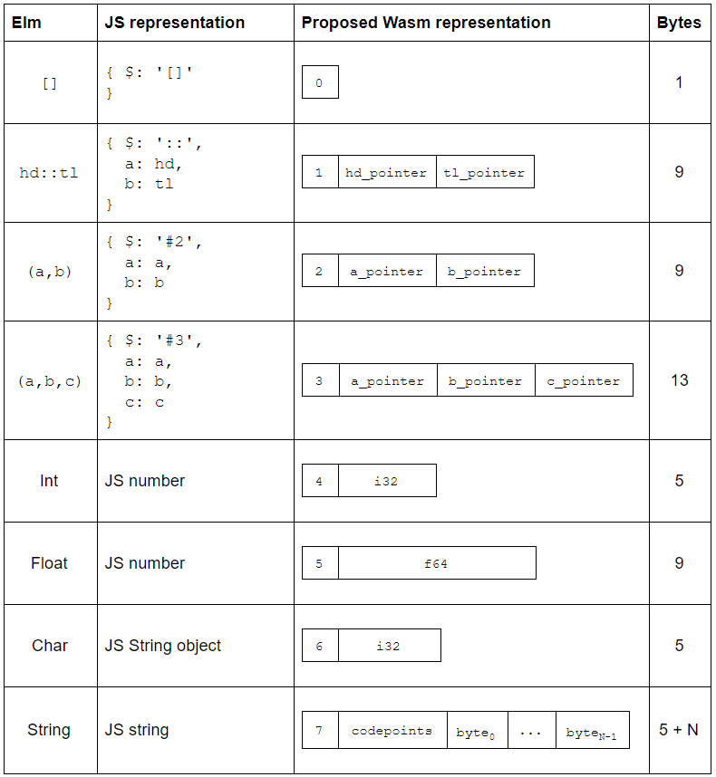

# Elm Wasm: Built-in types

In my [last post][fcf], I proposed some ideas for how Elm's first-class functions could work in WebAssembly in the future.

This time, let's look at some of the other value types in Elm. What do the most fundamental value types look like? Can integers and floating-point numbers just be raw machine numbers, or do they need to have some kind of wrapper? How about collections like Lists, Tuples and Union types? And what about the big one - extensible records, how would they work?

We'll cover all of that in this post. Then in future posts we'll look at some more related topics like string encoding and effect types.

By the way, WebAssembly is still an MVP and won’t really be ready for Elm until it has garbage collection (GC), and probably also direct access to Web APIs (which depends on GC). The [GC extension][gc] is still in ["feature proposal"][gc-proposal] stage (as of August 2018) so it could be a while before it's available. Also, I'm not part of the Elm core team.


[fcf]: https://dev.to/briancarroll/elm-functions-in-webassembly-50ak


## Built-in types 

Let's start with the fundamentals: `Int`, `Float`, `Char`, `String`, `List` and `Tuple`. You probably learned these during your first day or two learning Elm, but don't be deceived! There's actually a lot of subtlety under the covers here.

The Elm compiler defines a few "SuperTypes". (Other languages call them "typeclasses", but the Elm compiler source code calls them SuperTypes, so I'm going to go with that.) This is the mechanism that allows some functions like `++`, `+` and `>`, to work on *more than one but not all* value types.

The table below lists the three SuperTypes found in the core libraries, and which functions use them.

| **SuperType** | **Core library functions**                                   |
| ------------- | ------------------------------------------------------------ |
| `appendable`  | `++`                                                         |
| `number`      | `+`, `-`, `*`, `/`, `^`, `negate`, `abs`, `clamp`            |
| `comparable`  | `compare`, `<`, `>`, `<=`, `>=`, `max`, `min`, `Dict.*`, `Set.*` |

Here's a breakdown of which types belong to which SuperTypes

|          | **comparable** | **appendable** | **number** |
| :------: | :------------: | :------------: | :--------: |
|  `Int`   |       ✓        |                |     ✓      |
| `Float`  |       ✓        |                |     ✓      |
|  `Char`  |       ✓        |                |            |
| `String` |       ✓        |       ✓        |            |
|  `List`  |      ✓\*       |       ✓        |            |
| `Tuple`  |      ✓\*       |                |            |

\* Lists and tuples are only comparable if their contents are comparable

Low-level functions that operate on SuperTypes need to be able to look at an Elm value at *runtime*, and decide which type it is. For example the `compare` function (which is the basis for  `<`, `>`, `<=`, and `>=`) can accept five different types, and needs to run different low-level code for each. Since Elm code can only pattern-match on values from the *same* type, this has to be done in Kernel code. Let's look at the JavaScript implementation, and then think about how a WebAssembly version might work.


## Comparables in JavaScript 

Well Elm is open source, so we can just take a peek at the [Kernel code for `compare`][GitHub] to see how it's done. I've copied it below with modified comments. When reading this, focus on the *conditions* for the `if` statements and ignore everything else!

[GitHub]: https://github.com/elm/core/blob/master/src/Elm/Kernel/Utils.js#L87-L120

```js
function _Utils_cmp(x, y, ord) // Elm compiler will have ensured that x and y have the same type
{
	if (typeof x !== 'object') // True for JS numbers and strings (Elm Int, Float, and String)
	{
		return x === y ? /*EQ*/ 0 : x < y ? /*LT*/ -1 : /*GT*/ 1;
	}

	if (x instanceof String) // True for Elm Char
	{
		var a = x.valueOf();
		var b = y.valueOf();
		return a === b ? 0 : a < b ? -1 : 1;
	}
	
	if (x.$[0] === '#') // True for Elm Tuples ('#2' or '#3')
	{
		return (ord = _Utils_cmp(x.a, y.a))
			? ord
			: (ord = _Utils_cmp(x.b, y.b))
				? ord
				: _Utils_cmp(x.c, y.c);
	}

    // If we got this far, we've got Lists
    // traverse conses until end of a list or a mismatch
	for (; x.b && y.b && !(ord = _Utils_cmp(x.a, y.a)); x = x.b, y = y.b) {} // WHILE_CONSES
	return ord || (x.b ? /*GT*/ 1 : y.b ? /*LT*/ -1 : /*EQ*/ 0);
}
```

Elm integers, floats and strings compile to JavaScript primitives and can be identified using JavaScript's `typeof` operator. This is not something we'll have available in WebAssembly, so we'll have to find another way.

The other Elm types are all represented as different object types. `Char` values are represented as String objects and can be identified using the `instanceof` operator. String objects are just a little bit of JS weirdness that doesn't matter here except it happens to be handy for Elm to distinguish `Char` from `String` in debug mode. Anyway, the important thing is that `instanceof` is not available in WebAssembly, and we need something else.

In the next part of the function we get a clue that when Elm values are represented as JS objects, they normally have a `$` property. This is set to different values for different types. It's `#2` or `#3` for Tuples, `[]` or `::` for Lists, and can take on various other values for custom types and records.

Aha! This `$` thing actually looks like something we can use! We can easily find a way to represent that as bytes. In fact, when you compile Elm 0.19 to JavaScript using `--optimize`, the `$` property becomes a number! The empty List has $=0, a Cons cell has $=1, Tuple2 has $=2 and Tuple3 has $=3. That's *really* easy to represent as bytes. It can just be a small header prepended to the value.

OK so that's fine for lists and tuples, but what about Int, Float, Char and String? Well the easiest approach is to just give them a header too.

Let's see what that system looks like.


## Comparables in WebAssembly

A proposed set of representations is depicted below. Each value amongst the basic types is prepended with a single byte that behaves similarly to the `$` field in JavaScript.



Using these representations, we can distinguish between any of the values that are members of `comparable`,  `appendable`, or`number`.

For example, to add two Elm `number`values, the algorithm would be:

- If constructor is 5 (`Float`)
  - Do floating-point addition (f64.add)
- else
  - Do integer addition (i32.add)

This is great because in WebAssembly, integer and floating-point addition are different instructions. We're not allowed to be ambiguous about it like in JavaScript.

We can use similar algorithms to distinguish String (7) from List (0 or 1) for `appendable`.


-----


Great! This system works! We can implement all of Elm's basic types at the byte level, and we have a good approach to implement all of the relevant Kernel code in WebAssembly!

But wait, this is just one solution. Is it a good solution? Are there other ways? Are there tradeoffs?

Of course there are tradeoffs! Let's have a look at some of the main ones before we wrap up.


## What do other languages do differently?

OCaml is a great language to compare Elm with. It's from the same language family. And like Elm, it's eagerly evaluated.


## What about Strings and Unicode and stuff?

That topic is big enough that I want to leave it for another post! It's very much intertwined with effects and the runtime implementation, because encoding matters when you're talking to the "outside world".


## What about monomorphizing?

"Monomorphizing", what a word! Just... gaze at it. Magnificent.

OK, so I made an assumption above. I assumed that the type information we discussed needs to be available in the value representation at runtime. But just because that's how it's done in the current JavaScript implementation of Elm doesn't mean it's the only way to do it! It's also possible to generate several implementations of each SuperType function, one for each type. There's a compiler called [MLton][mlton] that does this for the Standard ML language, and they call it "monomorphizing". Evan mentions it as one of the [potential projects][projects] for people interested in contributing to Elm.

For me personally, I felt that investigating WebAssembly was more than big enough for a hobby project, so I haven't gone down that road. If I took on that much, I'd  end up getting nothing done. So I'm sticking with the approach of having some type information available at runtime. If you want to have a go, I'm sure it would be interesting.

[projects]: https://github.com/elm/projects#explore-monomorphizing-compilers
[mlton]: http://mlton.org/

## 


