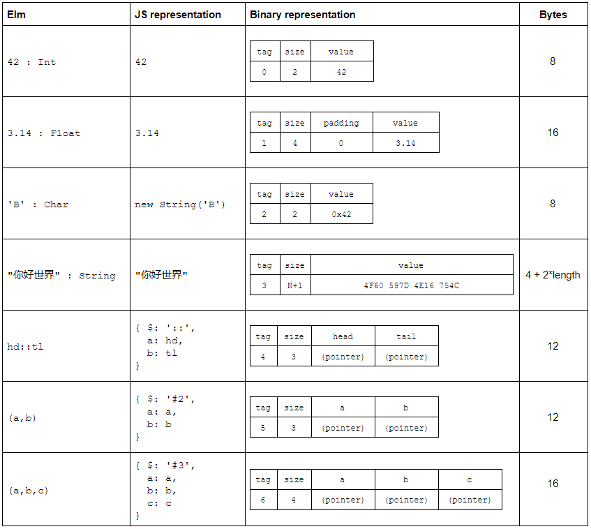

In my [last post][first-class-functions], I proposed some ideas for how Elm's first-class functions could work in WebAssembly.

This time, let's start looking at some of the other value types in Elm. What do the most fundamental value types look like?


## Comparables, Appendables and Numbers

Let's start with the fundamentals: `Int`, `Float`, `Char`, `String`, `List` and `Tuple`. It's fairly straightforward to design binary representations for these, but there are also some subtleties!

The trickiest aspect of these types in Elm is that they are all members of [constrained type variables][guide-type-vars]. This is the mechanism that allows some functions like `++`, `+` and `>`, to work on *more than one, but not all* value types.

[guide-type-vars]: https://guide.elm-lang.org/types/reading_types.html#constrained-type-variables

The table below lists the four constrained type variables, and which functions from the core libraries use them.

| **Type variable** | **Core library functions**                                   |
| ----------------- | ------------------------------------------------------------ |
| `appendable`      | `++`                                                         |
| `number`          | `+`, `-`, `*`, `/`, `^`, `negate`, `abs`, `clamp`            |
| `comparable`      | `compare`, `<`, `>`, `<=`, `>=`, `max`, `min`, `Dict.*`, `Set.*` |
| `compappend`      | (Internal compiler use only)                                 |

Here's a breakdown of which types belong to which type variables

|             | **number** | **comparable** | **appendable** | **compappend** |
| :---------: | :--------: | :------------: | :------------: | :------------: |
|    `Int`    |     ✓      |       ✓        |                |                |
|   `Float`   |     ✓      |       ✓        |                |                |
|   `Char`    |            |       ✓        |                |                |
|  `String`   |            |       ✓        |       ✓        |       ✓        |
|  `List a`   |            |      ✓\*       |       ✓        |      ✓\*       |
|  `(a, b)`   |            |      ✓\*       |                |                |
| `(a, b, c)` |            |      ✓\*       |                |                |

\* Lists and Tuples are only comparable only if their contents are comparable


Low-level functions that operate on these type variables need to be able to look at an Elm value and decide which concrete type it is. For example the `compare` function (which is the basis for  `<`, `>`, `<=`, and `>=`) can accept five different types, and needs to run different low-level code for each.

There's no syntax to do that in Elm code - it's deliberately restricted to Kernel code. Let's look at the JavaScript implementation, and then think about how a WebAssembly version might work. We'll focus on `comparable`, since it covers the most types.


## Comparable values in JavaScript 

Well Elm is open source, so we can just take a peek at the [Kernel code for `compare`][GitHub] to see how it's done. For the purposes of this article, we only care about how it tells the difference between different Elm types, so I've commented out everything else below.

[GitHub]: https://github.com/elm/core/blob/master/src/Elm/Kernel/Utils.js#L87-L120

```js
function _Utils_cmp(x, y, ord) // x and y will always have the same Elm type in a compiled program
{
	if (typeof x !== 'object')
	{
        // Elm Int, Float or String. Compare using `===` and `<`
	}

	if (x instanceof String)
	{
		// Elm Char. Take x.valueOf() and y.valueOf(), then compare.
	}
	
	if (x.$[0] === '#')
	{
		// Elm Tuples ('#2' or '#3'). Recursively compare contents.
	}

    //  ... Elm List (the only remaining comparable type). Recursively compare elements.
}
```

Elm's `Int`, `Float` and `String` values correspond directly to JavaScript primitives and can be identified using JavaScript's `typeof` operator. This is not something we'll have available in WebAssembly, so we'll have to find another way to get the same kind of information.

The other Elm types are all represented as different object types. `Char` values are represented as [String objects][string-objects] and can be identified using the `instanceof` operator. Again, `instanceof` is not available in WebAssembly, and we need something else.

In the next part of the function we get a clue that when Elm values are represented as JS objects, they normally have a `$` property. This is set to different values for different types. It's `#2` or `#3` for Tuples, `[]` or `::` for Lists, and can take on various other values for custom types and records. In `--optimize` mode it becomes a number.

Now this is something we _can_ do in WebAssembly. The `$` property is just an extra piece of data that's bundled along with the value itself. We can add a "header" of extra bytes in front of the runtime representation of every value to carry the type information we need.

[string-objects]: https://developer.mozilla.org/en-US/docs/Web/JavaScript/Reference/Global_Objects/String#Distinction_between_string_primitives_and_String_objects


## Value Headers

Many languages add a "header" to their value representations to carry metadata that's only for the runtime, not for the application developer. We can use that technique to distinguish the different types. All Elm types can be covered with only 11 tags, which only requires 4 bits.

It's also helpful to add a `size` parameter to the header, indicating the size in memory of the value in a way that is independent of its type. This is useful for memory operations like cloning and garbage collection, as well as for testing equality of strings, custom type values, and records.

In my [project][src-types-h] I've chosen the following bit assignments for the header. They add up to 32 bits in total, which is convenient for memory layout.

|      | Bits | Description                                                  |
| ---- | ---- | ------------------------------------------------------------ |
| Tag  | 4    | Elm value type. See enum definition above                    |
| Size | 28   | Payload size in 32-bit words. Maximum is 2<sup>28</sup>-1 units = (2<sup>28</sup>-1) * 4 bytes = 1GB |

[post-mvp-wasm]: https://hacks.mozilla.org/2018/10/webassemblys-post-mvp-future/
[src-types-h]: https://github.com/brian-carroll/elm_c_wasm/blob/master/src/kernel/types.h

The following C code represents the header.

```c
typedef enum {
    Tag_Int,
    Tag_Float,
    Tag_Char,
    Tag_String,
    Tag_List,
    Tag_Tuple2,
    Tag_Tuple3,
    Tag_Custom,
    Tag_Record,
    Tag_Closure,
} Tag;

typedef struct {
  u32 size : 28;  // payload size in integers (28 bits => <1GB)
  Tag tag : 4;    // runtime type tag (4 bits)
} Header;
```

## Comparable values in WebAssembly


 

Using these representations, we can distinguish between any of the values that are members of `comparable`, `appendable`, or `number`.

For example, to add two Elm `number`values, the algorithm would be:

- If tag is `Float` (1)
  - Do floating-point addition
- else
  - Do integer addition

We need this information because in WebAssembly, integer and floating-point addition are different [instructions](https://webassembly.github.io/spec/core/syntax/instructions.html#numeric-instructions). We're not allowed to be ambiguous about it like in JavaScript.

Functions operating on `appendable` values can use similar techniques to distinguish String (7) from List (0 or 1) and execute different code branches for each.


### Structural sharing

To have efficient immutable data structures, it's important that we do as much structural sharing as possible. The above implementations of List and Tuple allow for that by using pointers. For example when we copy a List, we'll just do a "shallow" copy, without recursively following pointers. The pointer is copied literally, so we get a second pointer to the same value.


## Summary

I've outlined some possible byte-level representations for the most basic Elm data types. We haven't discussed Custom types or Records yet. That's for the next post!

We discussed some of the challenges presented by Elm's "constrained type variables" `comparable`,  `appendable`, and `number` needing some type information at runtime. We came up with a way of dealing with this using "boxed" values with headers. We looked at how some languages use unboxed representations for integers in particular, and briefly touched on how this could be done for Elm at the cost of some complexity.

We dipped our toes into the huge topic of string representation, with some particular considerations for the browser environment in general and WebAssembly in particular.


If you like you can check out some of my GitHub repos

- A [fork of the Elm compiler](https://github.com/brian-carroll/elm-compiler) that generates Wasm (from my Elm AST test data, not from real apps!)
- Some of the [Elm kernel libraries in C](https://github.com/brian-carroll/elm_c_wasm), compiled to Wasm.